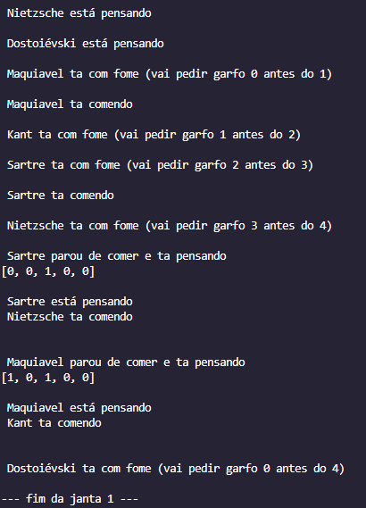
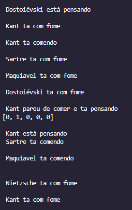
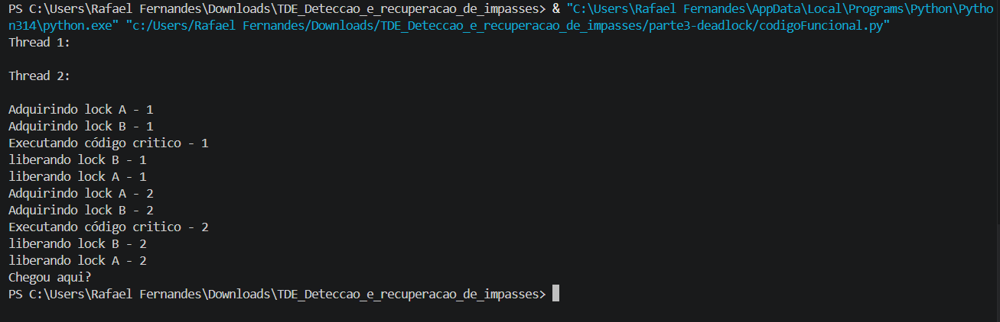
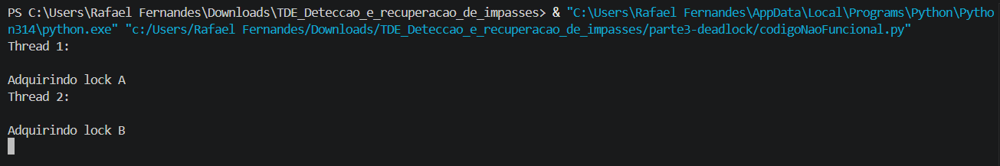

  

  ## TDE 2 - Detecção e Recuperação de Impasses
  
  >
  

## Link do Youtube

  

## Informações do Grupo
**Nome: Grupo 3**

**Integrantes:**
 * Artur Kuzma
 * Larissa Adames
 * Rafael Fernandes
   
## 🛠 Linguagem Utilizada

 

## Resumo Breve

Repositório criado com o intuito de documentar e registar os avanços do desenvolvimento do projeto "TDE 2 - Detecção e recuperação de impasses", atividade realizada na matéria de Performance em Sistemas Ciberfísicos lecionada pelo professor Andrey Cabral Meira. 

 
## Relatórios de Desenvolvimento

### RELATÓRIO PARTE 1 - O jantar dos Filósofos

### 1. INTRODUÇÃO 
**Espera Circular** acontece quando dois ou mais processos esperam pelo recurso que é mantido pelo próximo processo, onde o último processo depende do recurso do primeiro. Ex: p1 depende de p2 e p2 de p3, mas p3 depende de p1. 2. 

Que é exatamente o que acontece no Jantar dos Filosofos. No nosso caso nós temos 5 filósofos sentados em uma mesa, com um ciclo de vida que se baseia em: Comer, onde o filósofo está com dois garfos na mão jantando, Pensando, onde o filósofo está tranquilo apenas pensando e com fome, onde o filósofo está tentando comer. Exite um risco de deadlock se todos os filosofos pegarem seus garfos ao mesmo tempo.

### 2. DESENVOLVIMENTO

Ambos os scripts utilizam a biblioteca `threading`, representando cada filósofo como uma `Thread` e cada garfo como um `Lock`. São simulados 5 filósofos (Maquiavel, Kant, Sartre, Nietzsche e Dostoiévski), dispostos em uma mesa circular onde o garfo `i` fica entre o filósofo `i` e o filósofo `(i+1) mod N`. A cada execução, os filósofos alternam entre pensar (`sleep` com tempo aleatório) e tentar comer, sendo o estado de cada um registrado em uma lista compartilhada (`pensando`, `com fome`, `comendo`) e o número de refeições contado em `pratos`.

No arquivo `filosofosNaoFuncional.py`, cada filósofo simplesmente adquire `garfoE` (o garfo à sua esquerda) e depois `garfoD` (o garfo à sua direita), seguindo apenas a posição na mesa. Como essa ordem depende da disposição dos filósofos na mesa, e não de um critério goblal, onde o garfo esquerdo de um é o direito de outro. Existe a possibilidade de todos os garfos serem pegados ao mesmo tempo. Ou formar uma **espera circular** onde um filosofo pega o seu garfo da esquerda antes do seu vizinho pegar o da direita dele. 

Para evitar isso, aplicamos a **ordenação de recursos**, ao invés do filosofo escolher o garfo com base na posição da mesa, ele escolhe com base em um índice pre definido, sempre dando preferência para o menor índice e apenas depois para o maior, independente de qual seja a sua proximidade física, assim criando um critério global como citado anteriormente.

### 2.2 EVIDÊNCIA DE EXECUÇÃO
Foto codigo funcional:

Foto código ingênuo:

(eventualmente o código travava em deadlock)

### Conclusões
A comparação entre os dois scripts mostra que basta eliminar a espera circular para evitar o deadlock no jantar dos filósofos. As outras três condições de Coffman continuam presentes nos dois scripts; o que muda é a ordem de aquisição dos garfos: na versão com falha, ela depende da posição de cada filósofo na mesa, e na versão corrigida, ela segue sempre o índice numérico do garfo. Essa pequena mudança quebra o ciclo de dependência entre os filósofos e garante que o programa nunca trave, sem exigir nenhuma estrutura extra de coordenação.

### Orientações de Execução do Código
* Clone esse repositório normalmente em sua máquina; com o comando: `git clone https://github.com/Arture07/TDE_Deteccao_e_recuperacao_de_impasses.git`
* Em sua IDE de preferência (VS code é o recomendado) localize o projeto;
* Abra o terminal e execute o código com o comando: `cd .\filosofosFuncional\; python filosofosFuncional.py`.

### RELATÓRIO PARTE 2 - Sincronização com Semáforos

### 1. INTRODUÇÃO
  **Condição de Corrida** é uma falha que ocorre em sistemas concorrentes quando múltiplas threads tentam acessar e modificar um recurso compartilhado ao mesmo tempo. Sem sincronização, a ordem em que as threads são escalonadas pelo sistema operacional altera o resultado final, gerando estados inconsistentes ou dados corrompidos.
  
  Para garantir que a condição de corrida não ocorra e proteger onde o recurso compartilhado é acessado, utilizamos a sincronização. O mecanismo utilizado nesta parte do trabalho é o **Semáforo Binário**. Ele age como uma chave de exclusão mútua: apenas uma thread pode "adquirir" a permissão para acessar recursos compartilhados por vez e, enquanto não "liberar" a chave, qualquer outra thread que tente entrar ficará bloqueada em estado de espera.

### 2. DESENVOLVIMENTO 
  Nesse teste foi criado um script em Python para provar na prática o problema da perda de dados sem sincronização e a consistência dos dados com semáforo. A ideia proposta foi: lançar 8 threads, fazendo cada uma somar +1 em uma variável `total` cerca de 200.000 vezes. O resultado esperado ao final de tudo seria `1.600.000`. Essa parte 2 utiliza as bibliotecas `threading` para a criação, gerência de threads e inicialização do Semáforo binário e a biblioteca `time` para controlar os atrasos que induziam a falha, além de medir com precisão o tempo de execução e demonstrar  a troca de desempenho.

  Para que o erro ficasse mais claro na versão sem sincronização, foi aplicado um `time.sleep(0)`. Isso avisa ao *GIL* para pausar a thread atual e dar a vez para outra, assim sendo possível ver a perda de dados. 

### 2.2 Evidências de Execução

**Código Sem Sincronização (Perda de Dados):**
Ocorre perda de incrementos pela falta de atomicidade. A operação se divide em ler, somar e salvar. Múltiplas threads leem o mesmo valor antigo e sobrescrevem o trabalho umas das outras.

**Código Com Semáforo (Sucesso):**
Garante que a linha `total += 1` ocorra de forma exata e exclusiva. A thread pede licença (`acquire()`), efetua a soma e só então libera o acesso (`release()`).

### 3. CONCLUSÃO 
  Os testes mostram que a versão sem sincronização nunca atinge o valor correto em condições de alta concorrência devido à condição de corrida. Para solucionar o problema e assegurar `1.600.000` de forma exata, foi introduzido o semáforo binário. Ele estabelece uma barreira de memória garantindo exclusão mútua.

  Na teoria a sincronização introduz um "custo de processamento": o código sincronizado deveria ser mais lento pois exige trocas de estado e enfileira as threads. Porém, nos tempos de execução coletados na nossa tabela, a versão sem sincronização foi surpreendentemente mais lenta. Isso acontece por conta do `time.sleep(0)`. Como o Python possui o GIL, a linha `total += 1` é pseudo-atômica na maior parte do tempo. Para provarmos a perda de dados, adicionamos `sleep` para forçar o sistema a ceder a CPU no meio da operação. Chamar essa interrupção 1.6 milhão de vezes exigiu do SO um enorme volume  de trocas de contexto que custou mais tempo de processamento do que as pausas da fila do semáforo binário.

### Orientações de Execução do Código
* Clone esse repositório normalmente em sua máquina;
* Em sua IDE de preferência (VS code é o recomendado) localize o projeto;
* Abra o terminal e execute o código com o comando: `cd .\parte2-semaforo\; python parte2-semaforo.py`.

### RELATÓRIO PARTE 3 - DEADLOCK
### 1. INTRODUÇÃO
  DeadLock é um estado em que um sistema pode se encontrar onde um processo em execução (p1) espera um recurso que está sendo mantido por um outro processo em execução (p2), que por sua vez o p2 também está esperando um recurso que está sendo mantido pelo p1, assim causando um ciclo onde nenhum dos processos consegue ser concluído, pois, para serem concluídos, ambos necessitam de um recurso que está em posse do outro.  
  
  Para o DeadLock realmente acontecer, é necessário que quatro condições estejam ocorrendo simultaneamente, essas condições são conhecidas como “Condições de Coffman”, estas são: 
* 1. **Exclusão Mútua -** apenas um processo pode usar um mesmo recurso por vez;
* 2. **Retenção de Recursos -** um processo retêm pelo menos um recurso e ainda assim solicita recursos que estão sendo mantidos por outros processos;
* 3. **Sem preempção -** um recurso só pode ser liberado pelo próprio processo que o detém;
* 4. **Espera Circular -** dois ou mais processos esperam pelo recurso que é mantido pelo próximo processo, onde o último processo depende do recurso do primeiro. Ex: p1 depende de p2 e p2 de p3, mas p3 depende de p1. 2.
    
### 2. DESENVOLVIMENTO 
  No desenvolvimento dessa atividade, foram utilizados os pseudo códigos passados pelo professor para assim identificarmos como prosseguiríamos com a pesquisa. A ideia proposta no próprio texto de apoio foi a de realizar uma hierarquia de recursos, onde para solicitar o recurso Y o processo obrigatoriamente deveria ter solicitado o recurso X antes. O código que foi passado como referência para a situação falha (situação que causava o deadlock)  não permitia a conclusão da execução justamente devido a “falta” de hierarquia de recursos, onde a thread_1 solicitava o recurso “A” ao mesmo tempo em que a thread_2 solicitava o recurso “B”, e ao passarem para o próximo passo que deveriam realizar (thread_1 solicitar B e thread_2 solicitar A), se encontravam em conflito, onde nenhuma thread abria mão de seu recurso e ainda assim solicitava o outro recurso. Durante a execução deste código foram utilizadas as bibliotecas “threading” para a criação e gerência de threads e locks e a biblioteca  “time” para controlar com mais precisão o tempo de execução dos comandos, permitindo assim uma melhor clareza dos fatos. 
  
### 2.2 Evidências de Execução

Código Codigo Funcional: 

Codigo com Falhas:

Não executava o restante do código devido nenhum dos processos liberarem os recursos. 

### 3. CONCLUSÃO 
  Para solucionar o estado de deadlock do sistema, foi utilizada uma hierarquia de recursos, assim como proposto na atividade, exigindo que todas as threads solicitassem primeiramente o LOCK_A para que somente após isso pudessem solicitar o LOCK_B, assim quebrando a condição de “espera circular”, pois, a thread A não dependia de um recurso mantido pela thread B nem vice-versa, vale salientar que ordem de execução das threads não interferiu nos resultados de sucesso segundo o observado. Observe também que as condições de “sem preempção”, “exclusão mútua” e “retenção de recursos” não foram quebradas, ou seja, essas condições ainda são válidas no sistema, provando que para que o deadlock realmente ocorra, todas as “Condições de Coffman” precisam ser atendidas . 

 ## Orientações de Execução do Código
* Clone esse repositório normalmente em sua máquina;
* Em sua IDE de preferência (VS code é o recomendado) execute o código;

**OBS:** esse código não necessita de quaisquer outros passos para a sua execução.
